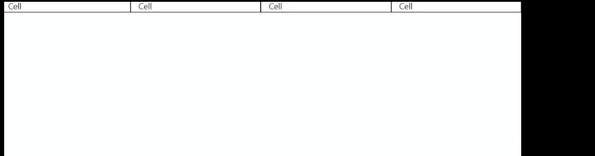

# 1. Basic Web Development

## Setup Tools

* DevDocs documentation: [https://devdocs.io/](https://devdocs.io/)
* Other good documentaiton: MDN, W3Schools
* VSCode prettier extension
* VSCode emmet extension \(cheatsheet of emmet - [https://docs.emmet.io/cheat-sheet/](https://docs.emmet.io/cheat-sheet/)\)
* Pesticide chrome: [https://chrome.google.com/webstore/detail/pesticide-for-chrome-with/neonnmencpneifkhlmhmfhfiklgjmloi/related](https://chrome.google.com/webstore/detail/pesticide-for-chrome-with/neonnmencpneifkhlmhmfhfiklgjmloi/related)

## HTML

* Good article about unicode: [https://www.joelonsoftware.com/2003/10/08/the-absolute-minimum-every-software-developer-absolutely-positively-must-know-about-unicode-and-character-sets-no-excuses/](https://www.joelonsoftware.com/2003/10/08/the-absolute-minimum-every-software-developer-absolutely-positively-must-know-about-unicode-and-character-sets-no-excuses/)
* i vs em tag: [https://developer.mozilla.org/en-US/docs/Web/HTML/Element/em\#%3Ci%3E\_vs.\_%3Cem%3E](https://developer.mozilla.org/en-US/docs/Web/HTML/Element/em#%3Ci%3E_vs._%3Cem%3E)
* em & strong tag should be preferred instead of i and b tag
* Emoji directory XD: [https://emojipedia.org/](https://emojipedia.org/)
* Favicon creator: [https://www.favicon.cc/](https://www.favicon.cc/)
* Lorem Ipsum Generator: [https://loremipsum.io/](https://loremipsum.io/)
* Icon download: [https://www.flaticon.com/](https://www.flaticon.com/), [https://www.iconfinder.com/](https://www.iconfinder.com/)
* Collection of good designed websites for inspiration: [https://dribbble.com/](https://dribbble.com/)
* CDN Font system: [https://fontawesome.com/](https://fontawesome.com/)
* Is website mobile friendly test of Google: [https://search.google.com/test/mobile-friendly](https://search.google.com/test/mobile-friendly)

```markup
This will open mail client with
yourName=inputVal
yourEmail=inputVal

<form
  action="mailto:ankitpriyarup@gmail.com"
  method="post"
  enctype="text/plain"
>
  <input type="text" name="yourName" placeholder="Your Name" />
  <input type="email" name="yourEmail" placeholder="Your Email" />
  <input type="submit" />
</form>
```

## CSS

* Good color pallets: [https://colorhunt.co/](https://colorhunt.co/)
* CSS default browser values: [https://www.w3schools.com/cssref/css\_default\_values.asp](https://www.w3schools.com/cssref/css_default_values.asp)
* When a property say `border-style: dotted none;` If there's 1 value it gets applied to all, 2 then top/bottom left/right, 3 then top left/right bottom, 4 then top right bottom left \(clockwise\)

```css
/* Say there's an p tag in webpage with class as myClass and id as myId */
p {
    color: red;
}

.myClass {
    color: green;
}

#myId {
    color: blue;
}

/* It will get displayed as blue if we remove #myId part then green if we delete
that aswell then finally red. (Ids are unique on an html page, an object can have
multiple class attached to it aswell)

Preference of id_selector > class_selector > element_selector 

Uses Ids for css selector are somewhere against as per standards */
```

* Psuedo state of the element \(one with : in front, example hovering over :hover\) 

```css
p:hover {
    color: black;
} 
```


* There are 4 display type - Block, Inline, Inline-Block, None Block takes up complete width like p, h1, h2..., where as span, a, img tag are inline and consumes only that much space which they require. Block element width-height can be changed though however inline cannot be. To have best of two worlds get inline-block \(img are kind of that\)
* There are 4 position types - Static, Relative, Absolute, Fixed Static is default, Relative has \(left, top, bottom, right relative to the natural position of element\) changing relative doesn't affect other element, Absolute position is absolute to its parent \(left, top, bottom, right i.e. set 0 to all and it's fullscreen\) setting absolute moves other elements and leaves new element floating. Fixed remains fixed \(top, left, right, bottom\) means it will remain fixed even after scrolling like in navbar

> z-index only works on positioned elements \(position: absolute, position: relative, position: fixed, or position: sticky\).

* Centering element with CSS: If it's say a block or inline block element then simply use some align property like text-align it will work but if it's an inline element then set `margin: 0 auto 0 auto` Top-Bottom margin 0 and Left-Right margin auto it will do horizontal-centoring


* This contains all fallback for fonts with percentage of how many have that font: [https://www.cssfontstack.com/](https://www.cssfontstack.com/)
* To browse and embedd web fonts: [https://fonts.google.com/](https://fonts.google.com/)
* CSS Button generator: [https://css3buttongenerator.com/](https://css3buttongenerator.com/)

We want image to float at right side and all info to stay at left. Just add `float: right;`to the image css


If we set `clear: right;` for the p tag then paragraph will go down and consume whole width \(cleares the effect of float for p\)


> Only use float when there's a specific use case over abusing it makes code unreadable instead rely on positioning rules

* Which element is rendered on top?


## Bootstrap

* Bunch of predefined styles & components: [https://getbootstrap.com/docs/5.0/getting-started/introduction/](https://getbootstrap.com/docs/5.0/getting-started/introduction/)
* Nav Bar: [https://getbootstrap.com/docs/4.6/components/navbar/](https://getbootstrap.com/docs/4.6/components/navbar/)
* Grid layout \(in wide screen more items in row then in phone\)

```markup
<!-- Equal division -->
<div class="row">
  <div class="col" style="background-color: red">First</div>
  <div class="col" style="background-color: green">Second</div>
  <div class="col" style="background-color: blue">Third</div>
</div>

<!-- Goes till 12 equal division of row, 6 means 50% -->
<div class="row">
  <div class="col-6" style="background-color: gray">
    First (6 out of 12)
  </div>
</div>
```


But now we want smaller screen to show less items in a row. With below code each cell has 3 units on larger screen, 4 units on medium screen and 6 units on smaller screen

```markup
<div class="row">
  <div class="col-lg-3 col-md-4 col-sm-6" style="border: 1px solid">
    Cell
  </div>
  <div class="col-lg-3 col-md-4 col-sm-6" style="border: 1px solid">
    Cell
  </div>
  <div class="col-lg-3 col-md-4 col-sm-6" style="border: 1px solid">
    Cell
  </div>
  <div class="col-lg-3 col-md-4 col-sm-6" style="border: 1px solid">
    Cell
  </div>
</div>
```



> By default value is 12 \(or 100%\)

* Container: [https://getbootstrap.com/docs/4.6/layout/overview/\#containers](https://getbootstrap.com/docs/4.6/layout/overview/#containers)
* Buttons: [https://getbootstrap.com/docs/4.6/components/buttons/](https://getbootstrap.com/docs/4.6/components/buttons/)
* Carousel \(Slideshow\): [https://getbootstrap.com/docs/4.6/components/carousel/](https://getbootstrap.com/docs/4.6/components/carousel/)

